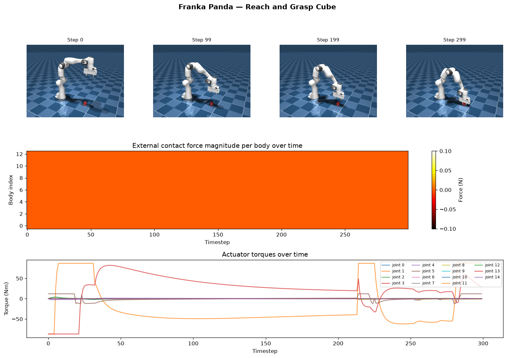

# GenForce

A robotics dataset generation system that produces force-augmented trajectories for training robot manipulation policies. Alongside standard joint positions and velocities, GenForce records contact forces and actuator torques at every timestep.



## Setup

```bash
git clone --recurse-submodules https://github.com/kalieching/genforce
cd genforce
conda create -n genforce python=3.11
conda activate genforce
pip install -r requirements.txt
```

## Usage

**Collect data**
```bash
python collect.py --episodes 20 --steps 300
```

**Train**
```bash
python train.py
```

**Replay an episode**
```bash
mjpython replay.py # live viewer (macOS)
python replay.py --save # export to output/replay.mp4
```

**Visualize force data**
```bash
python visualize.py
```

**Run tests**
```bash
pytest tests/
```
